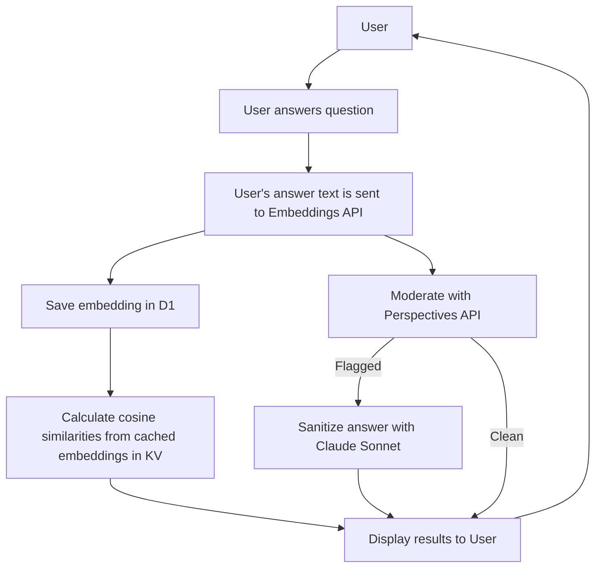

## Architecture Overview
User (Browser)
     ↓
Frontend (SvelteKit + Threlte)
     ↓
Cloudflare Worker (API Orchestration)
     ↓ ↓ ↓ ↓
Google Perspective API (Moderation)
Claude 3 Sonnet API (Sanitize flagged text)
OpenAI Embeddings 3 Large API (Generate Embeddings)
Cloudflare KV (Fetch static philosophical data + embeddings)
Cloudflare D1 (Store user responses, sanitized text, embeddings, cosine similarity)
     ↓
Frontend (Render answers + star/planet/comet map)

## Data Flow Explanation
* user answers question
* clientside sends data to cloudflare worker (answer text saved in D1)
* embeddings api determines viewpoint (save embedding in D1)
* calculate cosine similarities to see similarity to major schools of thought (save cosine similarities and major schools in D1)
* moderate answer text via perspectives api
* answer text is found to be clean:
	* display results using original version for all users
* answer text is flagged: (save flagged status in D1)
	* generate a clean version with claude (save clean version in D1)
	* display results using clean version for all other users
* clientside processing after data is received:
	* add new [[organization metaphor|planet/comet]] to page
	* update user's local stats

## Data Flow Diagram

